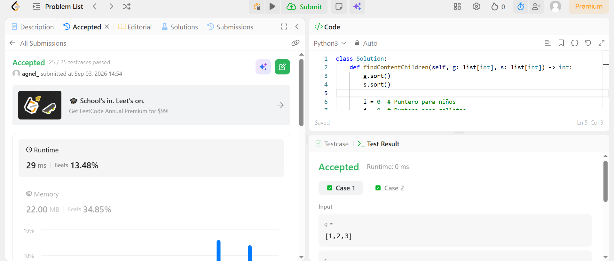
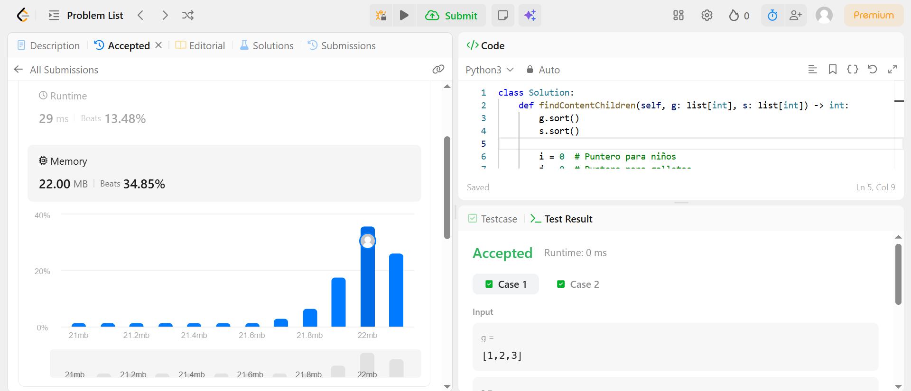

# 860. Lemonade Change

**Enlace al problema:** https://leetcode.com/problems/lemonade-change/

**criterio greedy:** Estrategia del Elemento Mayor Primero

## Enunciado 

En un puesto de limonadas, cada limonada cuesta $5. Los clientes están haciendo fila para comprarte y piden una a la vez (en el orden especificado por los billetes). Cada cliente solo comprará una limonada y pagará con un billete de $5, $10 o $20. Debes darle el cambio correcto a cada cliente para que la transacción neta sea que el cliente pague $5.

Ten en cuenta que al principio no tienes nada de cambio.

Dada una matriz de enteros bills (billetes) donde bills[i] es el billete con el que paga el $i$-ésimo cliente, devuelve true si puedes darle a cada cliente el cambio correcto, o false en caso contrario.

Restricciones:

1 <= bills.length <= 10ʌ5
bills[i] es 5, 10, or 20.

## Rendimiento

- **Complejidad de tiempo:** O(N), donde N es la longitud del arreglo bills. Se realiza una sola pasada lineal procesando cada cliente en O(1).

- **Complejidad de espacio:** O(1), ya que solo se emplean dos variables enteras (five y ten) para el estado de la caja.

## Evidencias

**Runtime**

**Memory**

# 455. Assign Cookies

**Enlace al problema:** https://leetcode.com/problems/assign-cookies/

**criterio greedy:** Criterio de Selección por Menor Tamaño de Recurso Suficiente

## Enunciado

"Asume que eres un padre fantástico y quieres darles algunas galletas a tus hijos. Pero debes darle a cada niño como máximo una galleta.

Cada niño i tiene un factor de codicia g[i], el cual es el tamaño mínimo de una galleta con el que el niño estará contento; y cada galleta j tiene un tamaño s[j]. Si s[j] >= g[i], podemos asignarle la galleta j al niño i, y el niño i estará contento. Tu objetivo es maximizar el número de hijos contentos y devolver ese número máximo."

## Evidencias

**Runtime**

**Memory**
